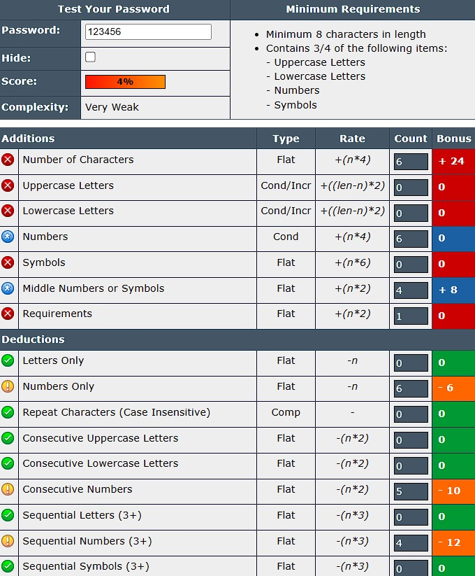
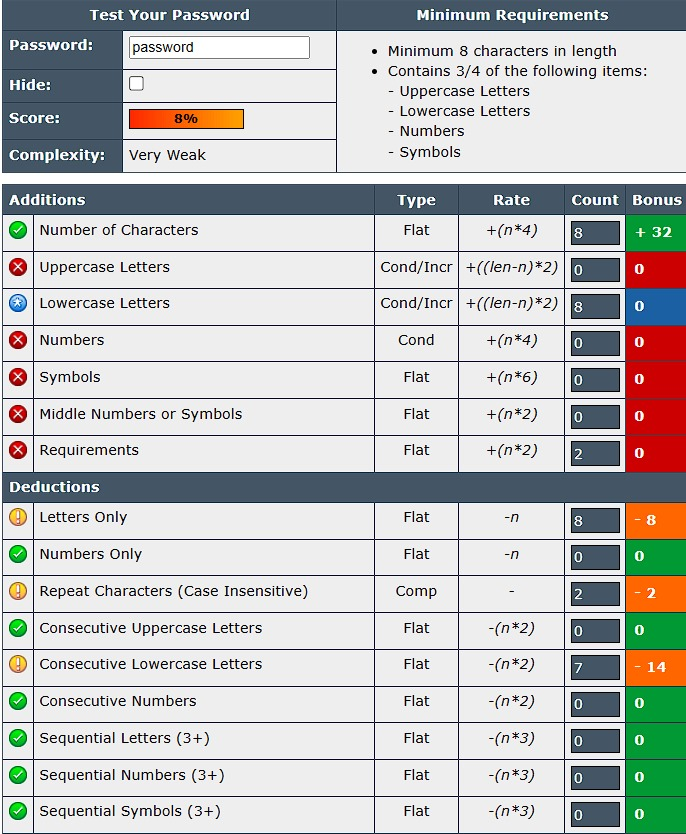
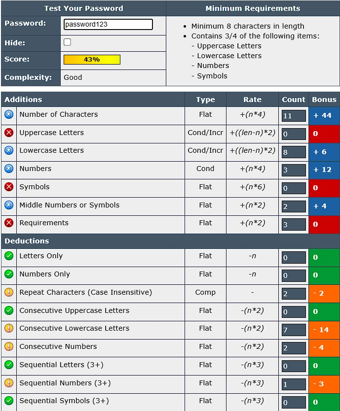
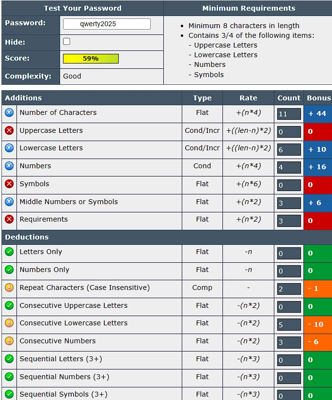
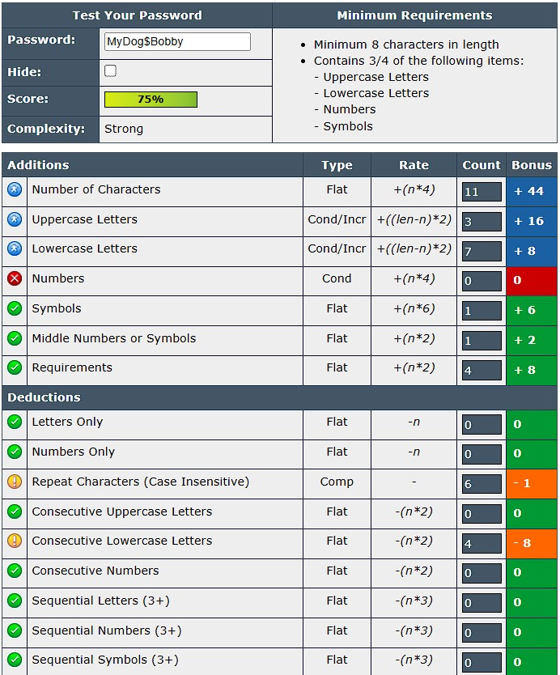
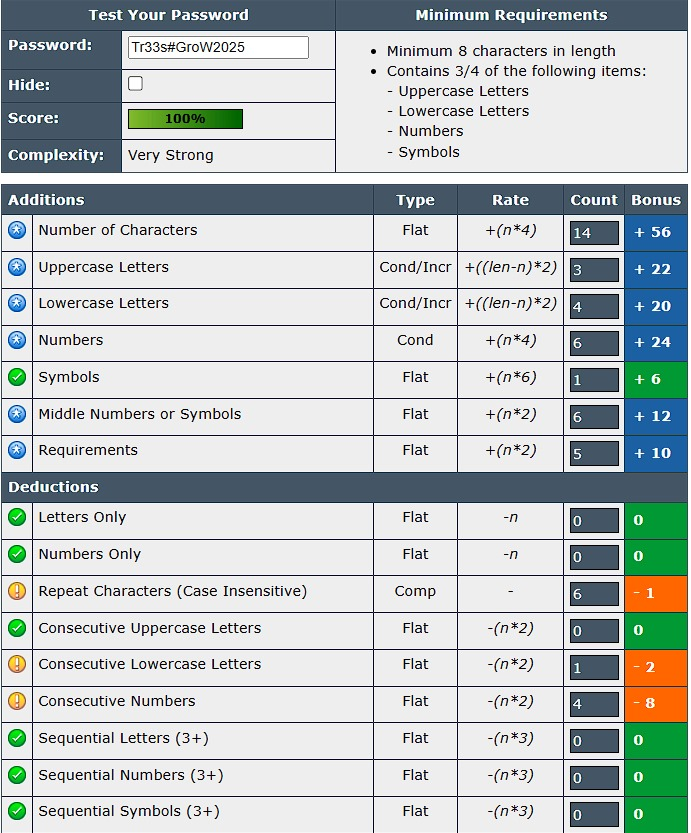
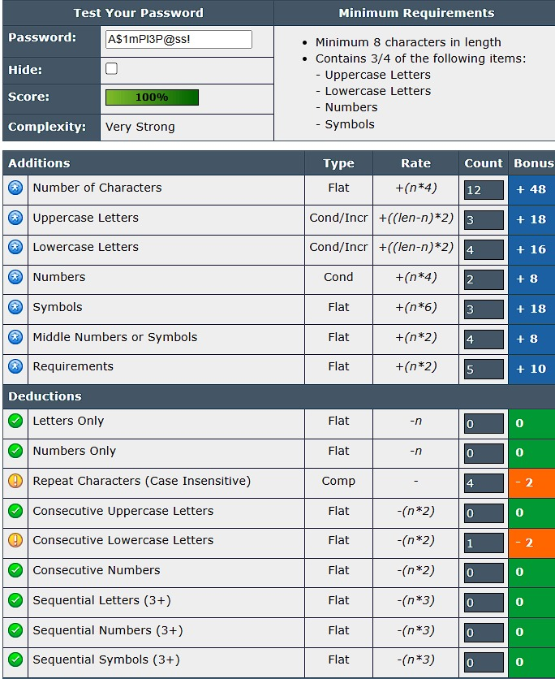

# strong-password-evaluator
🔒 Evaluated password strength to understand security factors and create stronger passwords.

## 🎯 Objective
To understand what makes a password strong and test it against online password strength checkers.

---

## 🧰 Tools Used
- [PasswordMeter.com](https://www.passwordmeter.com/)

---

## 🧪 Steps Followed

1. Created multiple passwords with different complexities.
2. Used uppercase, lowercase, numbers, symbols, and varied lengths.
3. Tested each password using the password strength checker.
4. Noted scores, feedback, and deductions.
5. Researched password best practices and common attacks.
6. Summarized the findings.

---

## 🧩 Passwords Tested & Results

| Password         | Score  | Complexity  | Remarks                              |
|------------------|--------|-------------|--------------------------------------|
| `123456`         | 4%     | Very Weak   | Only numbers, too short              |
| `password`       | 8%     | Very Weak   | Only lowercase, common word          |
| `password123`    | 43%    | Good        | Letters + numbers, but predictable   |
| `qwerty2025`     | 59%    | Good        | Contains digits, still sequential    |
| `MyDog$Bobby`    | 75%    | Strong      | Mixed characters but includes common words/names    |
| `Tr33s#GroW2025` | 100%   | Very Strong | Complex, long, diverse characters    |
| `A$1mPl3P@ss!`   | 100%   | Very Strong | Complex and random                   |

---

## 📸 Screenshots

> Add your actual screenshot files in the `screenshots/` folder and update paths if needed.

- **Very Weak**  
  
  

- **Good**  
  
  

  - **Strong**  
  

  

- **Very Strong**  
  
  

---

## 💡 Tips for Creating Strong Passwords

- ✅ Use 12+ characters
- ✅ Mix uppercase, lowercase, numbers, and symbols
- ✅ Avoid using personal info or dictionary words
- ✅ Don’t reuse passwords across sites
- ✅ Place numbers/symbols in the middle (not just end)

---

## ⚠️ Common Password Attacks

| Attack Type         | Description |
|---------------------|-------------|
| **Brute Force**     | Tries all combinations — longer passwords take more time to crack |
| **Dictionary Attack** | Uses lists of common passwords |
| **Credential Stuffing** | Uses leaked passwords across different platforms |

---

> Passwords are the first line of defense — make them count!

---
